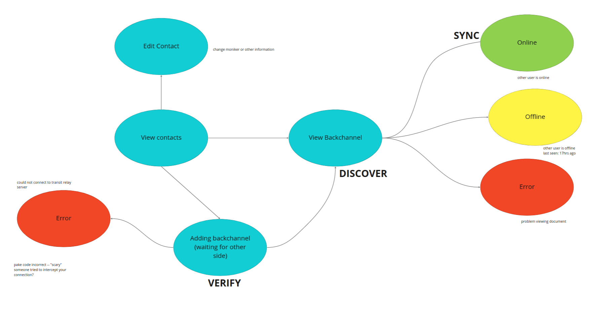

# Backend

## **Terminology**

- Device: A computer or phone.
- Contact: A human readable description of another user.
- Code: An ephemeral password used to derive a *key*. Can only be used once.
- Key: A unique cryptographic shared secret with high entropy (32 byte elliptic curve).
- Document: A local-first object that can be edited and synchronized between two or more devices.
- Mailbox: A server used to cache channels while a contact is offline.

## **App states**

## **Protocol**

**Phase VERIFY. Generating a shared secret.** 

Phase A is completed synchronously, i.e., when two peers are online at the same time or on the same local area network. Phase A only needs to be completed once per *contact. S*ome implementers of the protocol may want to complete this phase once per *device*, which changes the threat model. For the purposes of simplicity in the first version of this protocol, we say each contact only has one device. 

PAKE codes have two parts: a slot and a password. For example, In the code `12-swirl-motor`, the slot is `12` and the password is `swirl-motor`. The slot can be anything as long as it can be converted into a number and has some reasonable amount of entropy. The password contains  16 bits of entropy and is represented as two words using a pre-defined word list. 

1. The slot is chosen first. Ideally, it would be a slot that is currently unoccupied on the server. 
2. PeerA opens a websocket connection with the server on slot `12`.
3. PeerA then sends the code `12-swirl-motor` out of band to PeerB. 
4. PeerB then opens a websocket connection with the  server on slot `12`. 
5. The server routes the two peers together — i.e., forwards all messages between the two clients. The password itself is never shared with the server, and thus the server does not need to be trusted with the password, only the slot (see [spake2](https://tools.ietf.org/html/draft-irtf-cfrg-spake2-08)). 
6. After two round trips, the two peers are able to derive a shared secret key. There is only one chance to get the math correct, and if any of the challenges fail, the connection will be destroyed and the handshake will be unsuccessful. This gives active attackers only one chance to guess the code, preventing dictionary attacks.
7. This shared secret *key* will have 32 bytes of entropy. Once this key is generated, the PAKE code can be thrown away. 

Once the PAKE handshake is complete, both PeerA and PeerB will have a shared secret that they can use as an encryption key for further interactions.

**Phase DISCOVER. Search for other devices that have access to this document.**

In this phase, we use the *key* as an identifier for a particular document. We use a hash of the *key* to find other devices with copies of the document. We use the hash so that network eavesdroppers or the signaling server cannot learn the *key*.

Ideally, clients will use WebRTC to perform offers and answers to achieve a direct peer-to-peer connection with fallback to a TURN server. The benefits of WebRTC are that (1) it works on all platforms, (2) there are robust and well-tested libraries, (3) it performs NAT traversal which  improves speed for sharing large files, and (4) it automatically performs DTLS encryption which prevents eavesdropping, tampering, or message forgery.

One of the key security problems with WebRTC is that the signaling server needs to be trusted with the connection metadata, including IP addresses. To remove the signaling server from the trust model, we can use the *key* to establish the authenticity of the WebRTC metadata.

1. Compute a Blake3 hash of the *key (*[https://github.com/BLAKE3-team/BLAKE3](https://github.com/BLAKE3-team/BLAKE3))
2. Announce this Blake3 hash to the signaling server.
3. Perform WebRTC handshake — encrypt the WebRTC offer and answer using secret box with the *key.*
4. Create direct connection between peers using WebRTC.

At this point, we have strong proof that the connected device possesses a copy of the same derived secret key established in VERIFY phase. The resulting WebRTC connection is then encrypted using DTLS.

**Phase SYNC. Sharing data over an encrypted connection.**

At this stage, devices can start sending data to each other. We recommend application developers upgrade to another protocol that satisfies any specific needs.

For the backchannel prototype, we may want to upgrade to the Automerge protocol at this phase.

## Architecture

There is a Signaling Server which routes packets between peers who have connected to the same *slot.* The slot should be a string.

Each client connects to the Signaling Server over a Web Socket connection.

Data is stored on the local filesystem when a desktop application, the fileSystem API on Chrome, and IndexedDb otherwise.

## **Database**

**Document**

A document is a shared application state. Each user can have a copy of the document locally on several devices (which may belong to the same user, or to different users). Each user can independently update the application state on their local device, even while offline, and save the state to local disk. If the state was changed concurrently on different devices, *Automerge* automatically merges the changes together cleanly, so that everybody ends up in the same state, and no changes are lost.

- *key*. Each document is identified by a strong shared secret, also called a 'pre-shared key.'
- *content.* Refers to the user-generated content as part of the document.
- *metadata.* Refers to any system-generated content not edited directly by the user (e.g. device id, timestamp, vector clock, etc).

**Channel**

A channel is a type of document that represents a linear chat history between two users. The following fields are part of messages in the document. 

- *timestamp:* Clock time that the message was received for display purposes.
- *text:* Text accompanying the message
- *file:*
    - *filename:* The local filename of any content attached to this message.
    - *mimetype:* The mime type of this file.

**Contact Card** 

A contact card is a type of document that represents other users. The following fields are part of messages in the document 'content'. 

- *moniker*. This is a name that represents the contact.
- *channels.* A list of document pointers (*keys)*. A document *key is* a strong shared secret between all participants*.*
- *last_seen (optional):* A timestamp representing the last (local clock) time this contact was seen.
- *public_key* (*optional).* The public key of this contact. This public key could be used to provide end-to-end encryption in later versions of the application.

**System**

- *device_id:* This is a unique randomly-generated identifier for this device. The device_id should only be generated once when the application is opened the first time. This is used for identifying and merging changes between different devices. the *device_id* should be persisted to disk in a location separate from application data to minimize risk of loss.
- *keypair (optional)*: This is a public/private keypair. This can be imported from an existing keyring or generated when the application is opened the first time. The keypair can be overridden or replaced in certain circumstances (e.g., revocation). This keypair could be used to provide end-to-end encryption with contacts in later versions of the application.

**Settings**

The settings object can be accessed and edited by the user.

- *relay_server*: This is the URL to use for relaying data between contacts. By default it uses the magic wormhole relay server. Some users may want to use their own server and this gives them the option to configure this value. *tbd other magic wormhole options. In later version of the application we may expose more magic wormhole options, but first version will only offer the relay server.*
