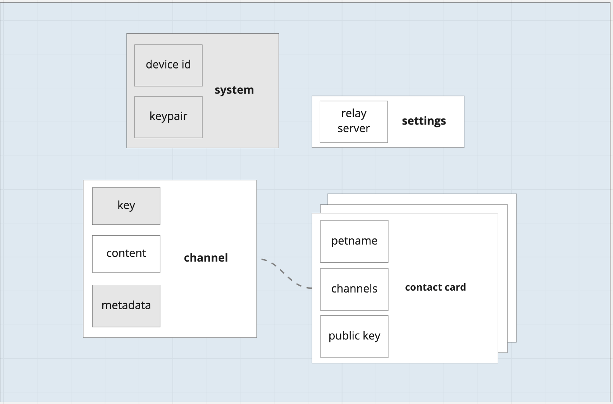

## **Database**

**Message**

A message is an object that represents a single message withing a linear chat
history between two users. The following fields are part of messages in the
document. 

- *timestamp:* Clock time that the message was received for display purposes.
- *type:* 'file' | 'text' | 'tombstone' | 'ack'
- *target*: The intended recipient of the message
- *incoming?:* If the message was incoming or outgoing

**Contact** 

A contact card is a type of document that represents other users. The following fields are part of messages in the document 'content'. 

- *id*. A string representing a local representation of that user (a uuid) which is not globally identifying, just for local indexing purposes
- *name*. This is a name that represents the contact.
- *last_seen (optional):* A timestamp representing the last (local clock) time this contact was seen.
- *key*. Each contact is identified by a strong shared secret, also called a symmetric key.
- *discoveryKey.* A hash of the key which is used to discover other peers with

**System**

- *dbName*: This is the name of the database which will be saved in IndexedDb.

**Settings**

The settings object can be accessed and edited by the user.

- *relay*: This is the URL to use for relaying data between contacts. Some users may want to use their own server and this gives them the option to configure this value. 