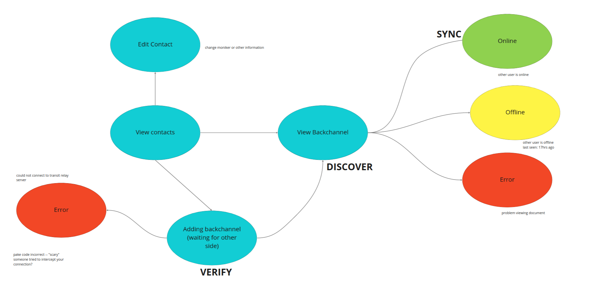

# Protocol

## **Terminology**

- Device: A computer or phone.
- Contact: A human readable description of another user.
- Code: An ephemeral password used to derive a *key*. Can only be used once.
- Key: A unique cryptographic shared secret with high entropy (32 byte elliptic curve).
- Document: A local-first object that can be edited and synchronized between two or more devices.
- Mailbox: A server used to cache channels while a contact is offline.

## **App states**

## **Protocol**

**Phase VERIFY. Generating a shared secret.** 

Phase A is completed synchronously, i.e., when two peers are online at the same time or on the same local area network. Phase A only needs to be completed once per *contact. S*ome implementers of the protocol may want to complete this phase once per *device*, which changes the threat model. For the purposes of simplicity in the first version of this protocol, we say each contact only has one device. 

PAKE codes have two parts: a slot and a password. For example, In the code `12-swirl-motor`, the slot is `12` and the password is `swirl-motor`. The slot can be anything as long as it can be converted into a number and has some reasonable amount of entropy. The password contains  16 bits of entropy and is represented as two words using a pre-defined word list. 

1. The slot is chosen first. Ideally, it would be a slot that is currently unoccupied on the server. 
2. PeerA opens a websocket connection with the server on slot `12`.
3. PeerA then sends the code `12-swirl-motor` out of band to PeerB. 
4. PeerB then opens a websocket connection with the  server on slot `12`. 
5. The server routes the two peers together — i.e., forwards all messages between the two clients. The password itself is never shared with the server, and thus the server does not need to be trusted with the password, only the slot (see [spake2](https://tools.ietf.org/html/draft-irtf-cfrg-spake2-08)). 
6. After two round trips, the two peers are able to derive a shared secret key. There is only one chance to get the math correct, and if any of the challenges fail, the connection will be destroyed and the handshake will be unsuccessful. This gives active attackers only one chance to guess the code, preventing dictionary attacks.
7. This shared secret *key* will have 32 bytes of entropy. Once this key is generated, the PAKE code can be thrown away. 

Once the PAKE handshake is complete, both PeerA and PeerB will have a shared secret that they can use as an encryption key for further interactions.

**Phase DISCOVER. Search for other devices that have access to this document.**

In this phase, we use the *key* as an identifier for a particular document. We use a hash of the *key* to find other devices with copies of the document. We use the hash so that network eavesdroppers or the signaling server cannot learn the *key*.

1. Compute a Blake3 hash of the *key (*[https://github.com/BLAKE3-team/BLAKE3](https://github.com/BLAKE3-team/BLAKE3))
2. Announce this Blake3 hash to the server.
3. Connect peers interested in the same topic over the server.
4. Encrypt contents using the NOISE protocol.

At this point, we have strong proof that the connected device possesses a copy of the same derived secret key established in VERIFY phase. 

**Phase SYNC. Sharing data over an encrypted connection.**

At this stage, devices can start sending data to each other. We recommend application developers upgrade to another protocol that satisfies any specific needs.

For the backchannel prototype, we may want to upgrade to the Automerge protocol at this phase.

## Architecture

There is a Signaling Server which routes packets between peers who have connected to the same *slot.* This server is a [magic-wormhole server](https://github.com/magic-wormhole/magic-wormhole).  The server should be configured in `journaled` mode which allows for asyncronous data storage.

Each client connects to the magic wormhole server over a Web Socket connection. Data is stored in the fileSystem API on Chrome, and IndexedDb otherwise.

## Using WebRTC (optional)

To achieve peer-to-peer connections in the browser, clients can use WebRTC to perform offers and answers. The benefits of WebRTC are that (1) it works on all platforms, (2) there are robust and well-tested libraries, (3) it performs NAT traversal which  improves speed for sharing large files, and (4) it automatically performs DTLS encryption which prevents eavesdropping, tampering, or message forgery. One of the key security problems with WebRTC is that the signaling server needs to be trusted with the connection metadata, including IP addresses. To remove the signaling server from the trust model, we can use the *key* to establish the authenticity of the WebRTC metadata.
